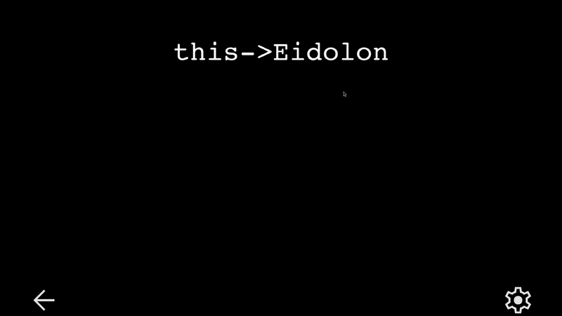
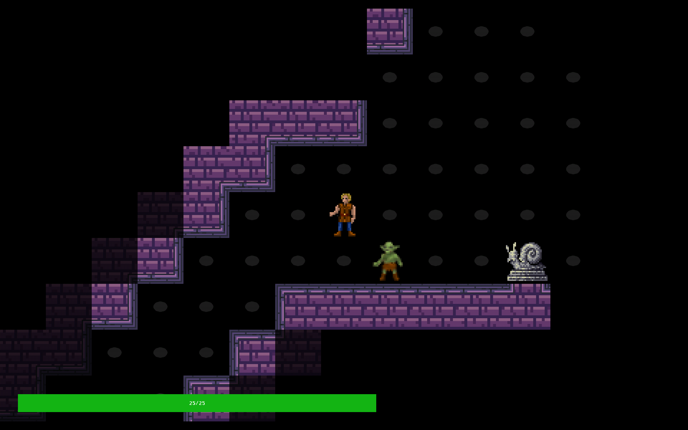

# this->Eidolon
*this->Eidolon* is a top-down, tile and turn-based roguelike where you can morph into the foes that have fallen before you, using their strengths and abilities to your advantage.

## Compiling
### Linux / Windows with WSL
1. In the root directory, run `cmake -B out`. This will generate the platform-specific build files (makefiles, etc) from the CMakeLists.txt, and put them in a directory named `out`.
2. Once it's finished, `cd out` to enter the directory.
3. Run `make`, which will run the platform-specific makefile(s) you generated with cmake.
4. Then, if you want to run the executable produced, type `./Eidolon`.
5. Tip: when iterating changes you can remain in the `out` directory and run `make` each time you want to rebuild, and make itself will re-run cmake when necessary, saving you from moving between things all the time.

### Visual Studio (NOT vscode)
Visual Studio should pick up that it's a cmake project. You should just be able to do Ctrl+B to build, or F5 to build and run.

You can also go the command line route if you don't have WSL, but use MSBuild as your build tool instead of make

See more about cmake in Visual Studio [here](https://learn.microsoft.com/en-us/cpp/build/cmake-projects-in-visual-studio)

## Helper classes/constructs
### Direction
Directions are enums, in order of rotation, so you can use them as Direction::NORTH, NORTHWEST, etc. but you can also multiply it by 45 to get a rotation in degrees.

### TileCoords
They have a Move helper function which returns a TileCoords moved one space in the Direction chosen.

### GetRandomValue (from raylib)
Returns a random int between A and B. Very helpful for random behaviour, etc.

### TileData
Contains an std::optional Creature, and a list of items. A Creature usually cannot move into a tile space that is Blocking(), i.e. there is an item in the space that has over 1000 weight.

### Usages and abilities
ItemObjects have usages, CreatureObjects have abilities. Each one has a valid usages/abilities variable that is a key/value list of strings (the ability name) and Ability*/Usage*, which is a pointer to a derived class of Ability*/Usage*. (todo)

## How To
### Adding Sprites for Tiles
1. First, add the sprite in to assets/tiles, with the name of the creature/item that it uses. For example, for humans, because the object's kind is "human", it uses the "./assets/tiles/human.png".
2. Next, add the tile to the list of tiles at the top of Tiles.h. This will ensure every tile is only loaded into a texture once, and all of them are unloaded properly.

After this, the tile should appear properly. If it doesn't, check that the file extension of the image is .png, and convert it if not. Also double-check that the name of the file before the file extension, the GameObject::kind of the target creature/item, and the name mentioned in Tiles.h all match.

### Testing
Follow the compilation steps above until after `make`, then run `make test` to run the tests.
To create new tests do the following:

1. Derive a class from Test in [Tests.cpp](tests/Tests.cpp) that implements `Run()`
2. Add another `string`/`Test*` pair to `Test::tests`.
3. Add a test to CMake with in the form `add_test(NAME <test-name> COMMAND TestSuite <test-name>)`. Make sure `<test-name>` matches the string in `Test::tests`.
4. Add the pass and fail regexes to the test using `set_property`; see the tests in [CMakeLists.txt](CMakeLists.txt).
